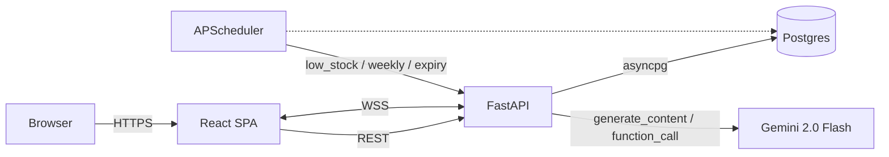

# SmartStore AI

> Intelligent Inventory & Vendor Management Platform — full-stack React + FastAPI + PostgreSQL + Google Gemini.

SmartStore AI gives small retail businesses one dashboard to run their store: product / supplier management, AI-drafted purchase orders, AI invoice OCR, demand forecasting, and automation agents that work overnight so the owner doesn't have to. Built as a Full-Stack AI Developer technical assessment.

---

## 1. Architecture

```
┌──────────────────┐   HTTPS    ┌────────────────────────┐   asyncpg   ┌──────────────┐
│  React + Vite    │ ─────────▶ │  FastAPI                │ ──────────▶ │  PostgreSQL  │
│  Tailwind        │ ◀───────── │  + APScheduler agents   │             │  (multi-tnt) │
│  Zustand + RQ    │  WSS /ws   │  + Gemini chat + vision │             └──────────────┘
└──────────────────┘            └──────────┬──────────────┘
                                           │ REST
                                           ▼
                                generativelanguage.googleapis.com
```



Repo layout:

```
backend/      FastAPI app, models, services, alembic, tests
frontend/     Vite + React + Tailwind app
docs/         Architecture, generator for sample invoices
.github/      CI workflow
docker-compose.yml
```

---

## 2. Tech stack

| Layer | Tech |
|---|---|
| Frontend | React 18, Vite 5, React Router 6, Zustand 5, @tanstack/react-query 5, Tailwind 3, Recharts 2, axios, react-hot-toast |
| Backend | Python 3.11, FastAPI 0.115, Pydantic 2.9, SQLAlchemy 2.0 (async), Alembic 1.13, APScheduler 3.10 |
| Database | PostgreSQL 16 (production), SQLite (tests) |
| AI / LLM | Google Gemini 2.0 Flash via `google-generativeai` 0.8 — chat with function calling + vision for OCR |
| OCR | Gemini vision with `response_schema`; `pdf2image` for PDF → image |
| Auth | JWT access (30m) + refresh (7d), bcrypt password hashing, Admin / Staff RBAC |
| Realtime | FastAPI WebSocket, tenant-scoped fan-out, React Query cache invalidation |
| DevOps | Docker + docker-compose, GitHub Actions CI (pytest + Vite build) |

---

## 3. Local setup — `docker-compose up`

**Requirements:** Docker Desktop. Nothing else.

```bash
git clone <your fork>
cd AI-SMART-STORE
cp .env.example .env
# open .env and paste your GEMINI_API_KEY  (free key from https://aistudio.google.com)
docker-compose up --build
```

That brings up three containers:

| Service | URL | Notes |
|---|---|---|
| `postgres` | `localhost:5432` | user / pw / db = `smartstore` |
| `backend` | http://localhost:8000 | FastAPI; OpenAPI at `/docs`; alembic + seed run automatically |
| `frontend` | http://localhost:5173 | Vite dev server |

Open http://localhost:5173 and log in with the seeded admin:

```
admin@smartstore.app  /  admin123       (Raj Grocery tenant)
staff@smartstore.app  /  staff123       (Raj Grocery — read-only staff)
admin2@smartstore.app /  admin123       (Demo Mart  tenant — proves multi-tenant isolation)
```

### Manual / non-docker setup

```bash
# Backend
cd backend
python -m venv .venv && source .venv/bin/activate   # (or .venv\Scripts\activate on Windows)
pip install -r requirements.txt
export DATABASE_URL=...   # see .env.example
alembic upgrade head
python -m app.seed
uvicorn app.main:app --reload

# Frontend (new shell)
cd frontend
npm install
npm run dev
```

### Sample invoices

Two test invoices live in `docs/sample_invoices/`. After cloning, run once to generate the PNGs:

```bash
pip install Pillow
python docs/generate_sample_invoices.py
```

---

## 4. The six modules

### A — Inventory Dashboard
- `GET /products`, `POST /products`, `PATCH /products/{id}`, `DELETE /products/{id}` (soft delete)
- Frontend: paginated table with category / status / search filters; modal add+edit; stock-health badges (green / amber / red / expired); summary cards on `/dashboard`.

### B — Suppliers & Purchase Orders
- Supplier CRUD (Admin only — Staff gets 403).
- PO create with line items, total auto-computed.
- Status workflow enforced: `draft → sent → acknowledged → received` (server rejects invalid transitions).
- "Send email" mock — logs to backend stdout and saves `sent_at`.
- On `received`, stock is incremented and a `stock_movement` row is appended.

### C — AI Store Assistant (`POST /ai/chat`)
- Powered by **Gemini 2.0 Flash** with function calling. System prompt locks the model to tool data only.
- 5 tools, all tenant-scoped:
  1. `get_low_stock_products`
  2. `get_product_detail`
  3. `get_po_history`
  4. `get_expiring_products`
  5. `create_draft_po` *(bonus — assistant can autonomously create POs)*
- Tool trace is returned in the API response and rendered as chips under each assistant message.

### D — Demand Forecast (`GET /products/{id}/forecast`)
- **Method:** 14-day simple moving average over outbound `stock_movements`. See "Forecast rationale" below.
- Frontend: Recharts line chart on `/products/:id` with labelled axes + legend.

### E — Invoice OCR (`POST /invoices/parse`, `POST /inventory/receive`)
- Gemini vision with strict `response_schema` returns `{supplier_name, invoice_date, line_items[], grand_total}`.
- PDFs are rasterized with `pdf2image` (poppler is installed in the backend image).
- Parsed line items are auto-matched to existing products by fuzzy name; user reviews + confirms; confirm writes stock movements and broadcasts a WebSocket `stock_update`.

### F — Agentic Automation
- **APScheduler** is started in the FastAPI lifespan and writes every run to `automation_logs`. Three agents:

| Job | Schedule | Output |
|---|---|---|
| `low_stock_agent` | daily 08:00 UTC | groups low-stock products by preferred supplier, creates one Draft PO per supplier |
| `weekly_summary_agent` | Mondays 09:00 UTC | persists a markdown report (total products, low-stock count, top 5 movers, pending POs, sales value) |
| `expiry_agent` | daily 07:00 UTC | scans products expiring within 14 days, persists a markdown report with suggested actions |

**For demo / video:** admins can trigger any agent on demand: `POST /automation/run/{job_name}` (also wired to buttons on `/automation`).

---

## 5. Auth & multi-tenancy

- JWT in `Authorization: Bearer <token>`. Access token is 30-minute; refresh token is 7-day with rotation on use.
- Roles enforced via FastAPI dependencies (`require_admin`). Staff cannot edit suppliers or send PO emails.
- Every business table carries a `tenant_id` FK. Every router resolves `tenant_id` from the JWT via `get_tenant_id` and applies a `WHERE tenant_id = :tid` filter. The seed script creates two tenants so you can prove isolation by logging in as `admin2@smartstore.app` — you should not see Raj Grocery's products.

## 6. Realtime stock updates (WebSocket)

`/ws?token=<access_token>` — JWT-auth'd, tenant-scoped. The server broadcasts `{type: "stock_update", product_id, new_stock}` after any:
- product PATCH that changes stock,
- inventory receive from an invoice,
- (extensible: PO `received` state change).

The frontend's `useWebSocket` hook invalidates the relevant React Query keys and shows a toast.

---

## 7. Forecast rationale

We use a **14-day simple moving average** of outbound `stock_movement.delta` to forecast the next 7 days. For an SMB grocery dataset (≤ 20 SKUs, ≤ a few months of history), more elaborate methods underperform:

- **ARIMA / Holt-Winters:** need stationary series + sufficient training samples; on sparse SKU history they fit noise.
- **Prophet:** designed for daily series with seasonality; overkill for short horizons and adds a heavy dependency.
- **LLM-generated forecast:** non-deterministic and not auditable for a store owner who wants to challenge the number.

SMA is interpretable ("we sold an average of X per day over the last two weeks"), fast (one SQL query), and degrades gracefully — if there is no history we fall back to a zero forecast and label the method `fallback_zero`. The endpoint returns the method name so the UI can surface it.

---

## 8. LLM choice

**Google Gemini 2.0 Flash** for both chat and vision. Reasons:

- Excellent function-calling fidelity and structured-output mode (`response_schema`) makes the OCR endpoint a one-call interaction with deterministic JSON shape.
- Generous free-tier RPM during development.
- Single SDK for both chat and vision — fewer credentials, fewer code paths.

Swapping providers is contained to two files: `app/services/llm_service.py` and `app/services/ocr_service.py`.

---

## 9. Bonus features implemented (+10)

- **Multi-tenant data isolation** — every model has `tenant_id`, every query filters on it, seed creates two tenants for proof. *(+3)*
- **`create_draft_po` LLM tool** — the assistant can autonomously create a Draft PO without the user going to the PO form. *(+2)*
- **WebSocket realtime stock updates** — tenant-scoped fan-out, React Query cache invalidation, toast. *(+2)*
- **Public deployment to Render + Vercel.** See "Deploy" section below. *(+2)*
- **GitHub Actions CI** — `pytest` + `ruff` on backend, Vite build on frontend, on every push. *(+1)*

---

## 10. Deploy (Render + Vercel)

**Backend + Postgres (Render):**
1. Create a Render Postgres free instance — copy its `DATABASE_URL`.
2. Create a Render Web Service from the GitHub repo: root `backend`, env `docker`, exposes port 8000.
3. Set env vars: `DATABASE_URL`, `SYNC_DATABASE_URL` (same URL but `postgresql+psycopg2://`), `JWT_SECRET`, `GEMINI_API_KEY`, `FRONTEND_ORIGIN=https://<your-vercel-app>.vercel.app`.
4. Render runs `alembic upgrade head && python -m app.seed && uvicorn app.main:app --host 0.0.0.0 --port 8000`.

**Frontend (Vercel):**
1. Import repo, root = `frontend`, framework = Vite.
2. Set env `VITE_API_URL=https://<render-backend>.onrender.com` and `VITE_WS_URL=wss://<render-backend>.onrender.com`.
3. Deploy.

---

## 11. Test plan

Backend:
```bash
cd backend
pytest -q
```
Tests use an in-memory SQLite database, mock the Gemini key as empty (so the assistant returns the configured-stub reply), and cover auth, products CRUD, the forecast endpoint, and two of the AI tools at the python-function level.

Frontend:
```bash
cd frontend
npm run build
```
A clean production build also runs in CI on every push.

End-to-end manual checks (matches §9.3 of the assessment):
1. Log in as admin / staff — staff cannot send PO emails (403).
2. Add a product with stock < threshold → it shows up red in the dashboard and table.
3. Open a product → forecast chart renders with labelled axes + legend.
4. Open the chat → ask "Which products will run out in 7 days?" — response cites real SKUs.
5. Ask the chat to "draft a PO for our lowest-stock supplier" — a Draft PO appears in `/purchase-orders`.
6. Upload `docs/sample_invoices/invoice_01.png` → review parsed lines → confirm → stock increments + WS toast in another tab.
7. Hit "Run low_stock_agent" on `/automation` → draft POs appear + log row written.
8. Log in as `admin2@smartstore.app` → confirm Demo Mart cannot see Raj Grocery's data.

---

## 12. Known limitations / what I would improve with more time

- **OCR robustness.** Vision LLMs misread handwritten or low-contrast invoices. A production system would route uncertain extractions to a human review queue and keep a confidence score per field.
- **Forecast.** SMA is fine for the scope but ignores seasonality. With 6+ months of data per SKU I would add Holt-Winters and A/B compare residuals.
- **Refresh token storage.** Tokens are kept in `localStorage` via Zustand persist. For a stricter security posture this should be an HttpOnly cookie + CSRF token.
- **PO email.** Currently a stdout log. Swap to a real SMTP via Postmark / SendGrid behind a feature flag.
- **WebSocket scale.** The in-process `WSManager` is fine for one backend instance. Multi-instance deploys need a Redis pub/sub bridge.
- **Test coverage.** Backend tests are smoke-level. A serious suite would add property-based tests on tenant isolation and a Playwright run on the frontend.

---

## 13. AI-assisted development

This project was scaffolded with the help of Claude Code (Opus 4.7). I directed the architecture, made every framework / library / model decision, reviewed every file, and wrote / edited everything. I am comfortable defending each design choice and extending the code in a follow-up call.

---

## 14. Commit history

Target: ≥ 30 meaningful commits, one per feature slice (auth → products CRUD → suppliers → POs → forecast → chat → OCR → automation → multi-tenant → WebSocket → deploy → CI → polish).

---

## 15. Demo video

A 5–10 minute walkthrough hitting every checkbox in §9.3 of the assessment is linked here once recorded:

> _Demo video: <to be added>_
